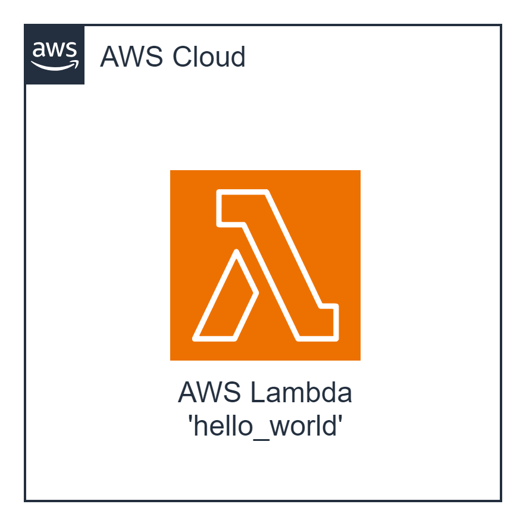

#### Architecture:
<div style="text-align: center;">
  
</div>

#### New Tool: AWS Lambda
`Amazon Web Services (AWS) Lambda` is a serverless computing service that lets you run code without provisioning or managing servers. You pay only for the compute time you consume—there is no charge when your code is not running. With Lambda, you can run code for virtually any type of application or backend service—all with zero administration. Just upload your code, and Lambda takes care of everything required to run and scale your code with high availability. You can set up your code to automatically trigger from other AWS services, or you can call it directly from any web or mobile app.

In this task, you'll be deploying a simple Lambda function named 'hello_world' that responds with a predefined JSON message.

#### The Goal Of This Task is...
To deploy a Lambda function that returns the following response:
```json
{
	"statusCode": 200,
	"message": "Hello from Lambda"
}
```

 **AWS-syndicate:**
- Make sure you have `aws-syndicate` installed. If not - follow the installation instructions provided in the installation tutorial.

#### For this task you should:

1. **Generate Project:**
   - Use `aws-syndicate` to generate a new project. This will set up the basic structure needed for your Lambda deployment.

2. **Generate Lambda with Runtime Java:**
   - Inside your project, use `aws-syndicate` to generate a Lambda function with Java as the runtime. This step will create the necessary files and configurations.

3. **Build and Deploy Project with the Syndicate Tool:**
   - Use the `aws-syndicate` tool to build and deploy your project. This step ensures that your Lambda function is packaged and deployed to AWS Lambda.

4. **Execute the Function via AWS Console:**
   - Go to the AWS Lambda Console, find your deployed 'hello_world' function, and execute it.
   - Ensure that the response matches the expected output:
     ```json
     {
         "statusCode": 200,
         "message": "Hello from Lambda"
     }
     ```

#### Validation:

1. **Check AWS Lambda Console:**
   - Confirm that your 'hello_world' function is listed in the AWS Lambda Console.
   - Verify that there are no deployment errors.

2. **Execute Function:**
   - Use the AWS Lambda Console to test your function.
   - Validate that the function returns a response with a status code of 200 and the message "Hello from Lambda."

Completing these steps successfully indicates that you have deployed a basic Lambda function that returns the expected response.

Congratulations! You've successfully deployed your first Lambda function. This is a foundational step in understanding serverless computing on AWS.