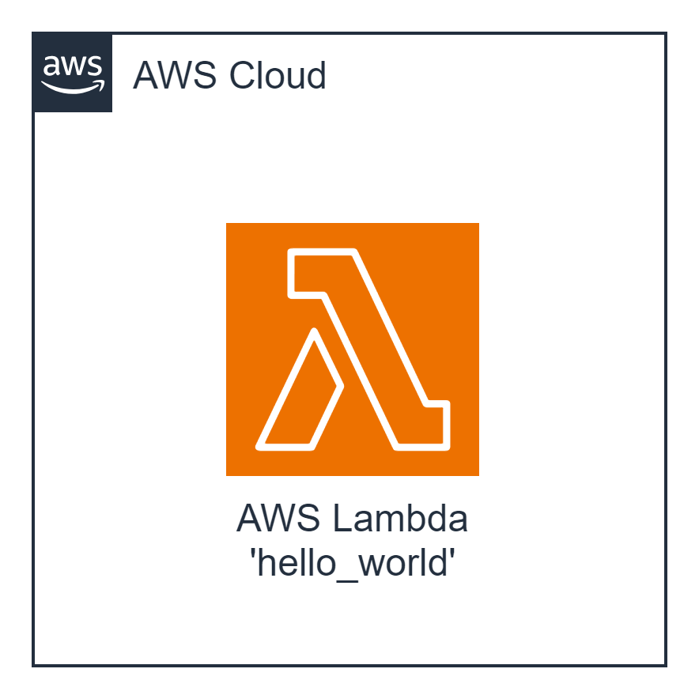

#### Architecture:

<div style="text-align: center;">
  
</div>

Building upon the basics of AWS Lambda, this task involves deploying a Lambda function with a configured Function URL. The function will respond with a predefined message when accessed through the `/hello` GET resource.

#### The Goal Of This Task is...
To deploy a Lambda function with a configured Function URL and ensure that accessing the `/hello` GET resource returns the following response:
```json
{
	"statusCode": 200,
	"message": "Hello from Lambda"
}
```

 **AWS-syndicate:**
   - Make sure you have `aws-syndicate` installed. If not - follow the installation instructions provided in the installation tutorial.


#### For this task you should:

1. **Generate Project:**
   - Use `aws-syndicate` to generate a new project. This will set up the basic structure needed for your Lambda deployment.

2. **Generate Lambda with Runtime Java:**
   - Inside your project, use `aws-syndicate` to generate a Lambda function with Java as the runtime. This step will create the necessary files and configurations.

3. **Configure Lambda with Function URL Enabled:**
   - Modify your Lambda function configuration to enable the Function URL. This step ensures that your Lambda function can be accessed via a Function URL.

4. **Build and Deploy Project with the Syndicate Tool:**
   - Use the `aws-syndicate` tool to build and deploy your project. This step packages and deploys your Lambda function, including the Function URL configuration.

5. **Configure API Client:**
   - Choose an API client such as Postman or Insomnia.
   - Set up a request to the Function URL with the `/hello` GET resource.
   - Send the request and verify that the response matches the expected output:
     ```json
     {
         "statusCode": 200,
         "message": "Hello from Lambda"
     }
     ```

#### Validation - Explanation How to Check If the Task Was Successfully Passed:

1. **Check AWS Lambda Console:**
   - Confirm that your Lambda function is listed in the AWS Lambda Console.
   - Verify that there are no deployment errors.

2. **Function URL:**
   - Access the `/hello` GET resource using the Function URL.

3. **API Client Request:**
   - Use your chosen API client (Postman, Insomnia) to send a GET request to the Function URL's `/hello` resource.
   - Verify that the response matches the expected output.

4. **Logs:**
   - Check the AWS CloudWatch Logs for your Lambda function to ensure there are no errors logged during the execution.

Completing these steps successfully indicates that you have deployed a Lambda function with a Function URL and verified its functionality through an API client. Well done on progressing to more advanced Lambda configurations!