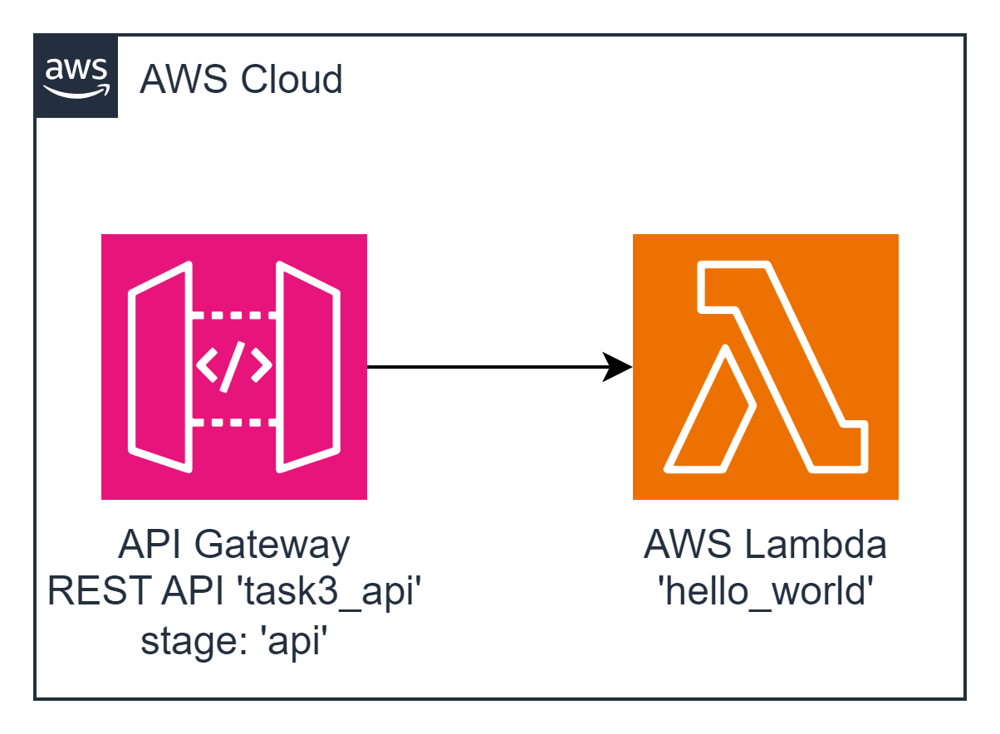

#### Architecture:
<div style="text-align: center;">
  
</div>

#### New Tool: AWS API Gateway
``Amazon API Gateway`` is a fully managed service that makes it easy for developers to create, publish, maintain, monitor, and secure APIs at any scale. With a few clicks in the AWS Management Console, you can create an API that acts as a “front door” for applications to access data, business logic, or functionality from your back-end services, such as workloads running on Amazon EC2, code running on AWS Lambda, or any web application. Amazon API Gateway handles all the tasks involved in accepting and processing up to hundreds of thousands of concurrent API calls, including traffic management, authorization and access control, monitoring, and API version management

This task involves deploying a Lambda function along with API Gateway. The API Gateway will have a `/hello` GET resource with a specific request configuration and a predefined response when accessed.

#### The Goal Of This Task is...
To deploy a Lambda function and an API Gateway with the following API resources:
- **Resource:** `/hello` 
- **HTTP Method:** GET
- **Request:** Empty (no request payload)
- **Response:**
  ```json
  {
  	"statusCode": 200,
  	"message": "Hello from Lambda"
  }
  ```

 **AWS-syndicate:**
   - Make sure you have `aws-syndicate` installed. If not - follow the installation instructions provided in the installation tutorial.


#### For this task you should:

1. **Generate Project:**
   - Use `aws-syndicate` to generate a new project. This will set up the basic structure needed for your Lambda deployment.

2. **Generate Lambda with Runtime Java 8:**
   - Inside your project, use `aws-syndicate` to generate a Lambda function with Java 8 as the runtime. This step creates the necessary files and configurations for your Lambda function.

3. **Generate API Gateway Metadata:**
   - Use `aws-syndicate` to generate API Gateway metadata that includes the required API resources:
     - Resource: `/hello`
     - HTTP Method: GET
     - Request: Empty (no request payload)
     - Response:
       ```json
       {
           "statusCode": 200,
           "message": "Hello from Lambda"
       }
       ```

4. **Build and Deploy Project with the Syndicate Tool:**
   - Use the `aws-syndicate` tool to build and deploy your project. This step packages and deploys your Lambda function along with the configured API Gateway.

5. **Configure API Client:**
   - Choose an API client such as Postman or Insomnia.
   - Set up a request to the API Gateway stage with the `/hello` GET resource.
   - Send the request and verify that the response matches the expected output.

#### Validation - Explanation How to Check If the Task Was Successfully Passed:

1. **Check AWS Lambda Console:**
   - Confirm that your Lambda function is listed in the AWS Lambda Console.
   - Verify that there are no deployment errors.

2. **API Gateway Console:**
   - Confirm that the API Gateway is listed in the AWS API Gateway Console.
   - Verify that the `/hello` resource is configured with the correct HTTP method and response.

3. **API Client Request:**
   - Use your chosen API client (Postman, Insomnia) to send a GET request to the API Gateway stage's `/hello` resource.
   - Verify that the response matches the expected output.

4. **Logs:**
   - Check the AWS CloudWatch Logs for your Lambda function to ensure there are no errors logged during the execution.

Completing these steps successfully indicates that you have deployed a Lambda function with API Gateway and confirmed its functionality through an API client. Great job advancing your AWS Lambda and API Gateway skills!