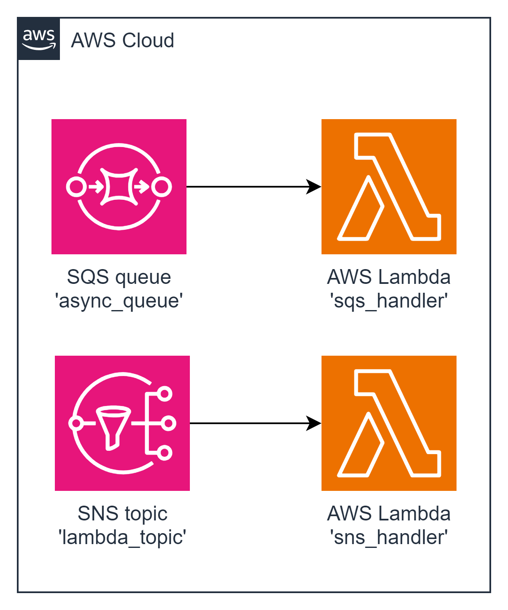

#### Architecture:

  

#### New Tools: Amazon Simple Queue Service (SQS) and Simple Notification Service (SNS)
`Amazon Simple Notification Service (Amazon SNS)` is a highly available, durable, secure, fully managed pub/sub messaging service that enables you to decouple microservices, distributed systems, and serverless applications. Amazon SNS provides topics for high-throughput, push-based, many-to-many messaging. Using Amazon SNS topics, your publisher systems can fan out messages to a large number of subscriber endpoints for parallel processing, including Amazon SQS queues, AWS Lambda functions, and HTTP/S webhooks. Additionally, SNS can be used to fan out notifications to end users using mobile push, SMS, and email.

`Amazon Simple Queue Service (Amazon SQS)` is a fully managed message queuing service that enables you to decouple and scale microservices, distributed systems, and serverless applications. SQS eliminates the complexity and overhead associated with managing and operating message oriented middleware, and empowers developers to focus on differentiating work. Using Amazon SQS, you can send, store, and receive messages between software components at any volume, without losing messages or requiring other services to be available. Get started with Amazon SQS in minutes using the AWS Management Console, AWS CLI, or SDK of your choice, and three simple commands.

This task involves creating two Lambda integrations—one with an SQS queue and another with an SNS topic. The 'SQS Handler' Lambda should be triggered by an SQS queue and log the message content to CloudWatch Logs. Similarly, the 'SNS Handler' Lambda should be triggered by an SNS topic and log the message content to CloudWatch Logs.

#### The Goal Of This Task is To...
1. Create an 'SQS Handler' Lambda that logs messages from an SQS queue.
2. Create an 'SNS Handler' Lambda that logs messages from an SNS topic.

 **AWS-syndicate:**
   - Make sure you have `aws-syndicate` installed. If not - follow the installation instructions provided in the installation tutorial.

#### For this task you should:

1. **Generate Project:**
   - Use `aws-syndicate` to generate a new project. This will set up the basic structure needed for your Lambda deployment.

2. **Generate 'SQS Handler' Lambda Function with Runtime Java 8:**
   - Inside your project, use `aws-syndicate` to generate a Lambda function named 'SQS Handler' with Java 8 as the runtime. This step creates the necessary files and configurations for the Lambda.

3. **Generate SQS Queue Resource in Meta:**
   - Use `aws-syndicate` to generate metadata for an SQS queue resource.

4. **Configure Lambda to be Triggered by the Queue:**
   - Modify the Lambda function configuration to be triggered by the SQS queue using Syndicate.

5. **Implement the Logic of the 'SQS Handler' Function:**
   - In the Lambda function code, implement the logic to print the content of the SQS message to CloudWatch Logs.

6. **Build and Deploy Project with the Syndicate Tool:**
   - Use the `aws-syndicate` tool to build and deploy your project, including the 'SQS Handler' Lambda and the configured SQS queue.

7. **Send Message to SQS Queue:**
   - Use the AWS SQS Console or CLI to send a message to the configured SQS queue.
   - Check CloudWatch Logs to ensure that the 'SQS Handler' Lambda flushes the message content.

8. **Generate 'SNS Handler' Lambda Function with Runtime Java 8:**
   - Inside your project, use `aws-syndicate` to generate a Lambda function named 'SNS Handler' with Java 8 as the runtime.

9. **Generate SNS Topic Resource in Meta:**
   - Use `aws-syndicate` to generate metadata for an SNS topic resource.

10. **Configure Lambda to be Triggered by the Topic:**
    - Modify the Lambda function configuration to be triggered by the SNS topic.

11. **Implement the Logic of the 'SNS Handler' Function:**
    - In the Lambda function code, implement the logic to print the content of the SNS message to CloudWatch Logs.

12. **Build and Deploy Project with Syndicate Tool:**
    - Use the `aws-syndicate` tool to build and deploy your project, including the 'SNS Handler' Lambda and the configured SNS topic.

13. **Send Message to SNS Topic:**
    - Use the AWS SNS Console or CLI to send a message to the configured SNS topic.
    - Check CloudWatch Logs to ensure that the 'SNS Handler' Lambda flushes the message content.

#### Validation - Explanation How to Check If the Task Was Successfully Passed:

1. **Check AWS Lambda Console:**
   - Confirm that both 'SQS Handler' and 'SNS Handler' Lambdas are listed.
   - Verify that there are no deployment errors.

2. **Check SQS and SNS Consoles:**
   - Confirm that the SQS queue and SNS topic are listed in the respective AWS Consoles.
   - Verify that the SQS queue and SNS topic messages are received by respective Lambdas.

3. **CloudWatch Logs:**
   - Check the CloudWatch Logs for the 'SQS Handler' Lambda after sending a message to the SQS queue.
   - Check the CloudWatch Logs for the 'SNS Handler' Lambda after sending a message to the SNS topic.

Completing these steps successfully indicates that you have created Lambda functions integrated with SQS and SNS, and they are logging messages to CloudWatch Logs as expected. Fantastic job navigating AWS Lambda integrations!