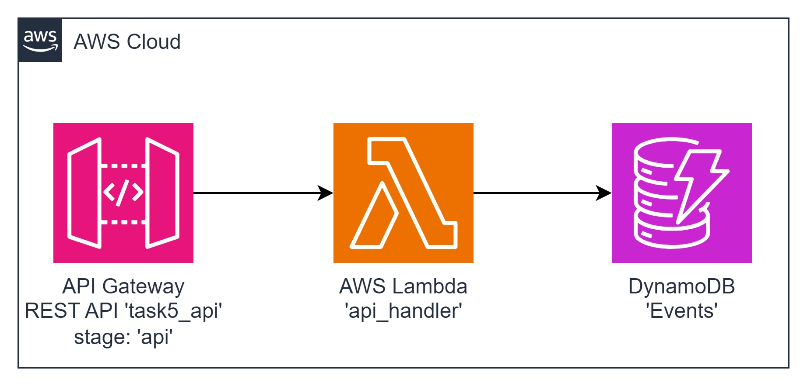

#### Architecture:

<div style="text-align: center;">
  
</div>

#### New Tool: Amazon DynamoDB
`Amazon DynamoDB` is a key-value and document database that delivers single-digit millisecond performance at any scale. It's a fully managed, multi-Region database with built-in security, backup and restore, and in-memory caching for internet-scale applications. DynamoDB can handle more than 10 trillion requests per day and support peaks of more than 20 million requests per second. Many of the world's fastest growing businesses such as Lyft, Airbnb, and Redfin, as well as enterprises such as Samsung, Toyota, and Capital One, depend on the scale and performance of DynamoDB to support their mission-critical workloads. Hundreds of thousands of AWS customers have chosen DynamoDB as their key-value and document database for mobile, web, gaming, ad tech, Internet of Things (IoT), and other applications that need low-latency data access at any scale. Create a new table for your application and let DynamoDB handle the rest.

This task involves deploying a Lambda function, an API Gateway, and a DynamoDB table named 'Events.' The goal is to create an API endpoint that saves incoming events to the 'Events' table in DynamoDB. The API must expose a `/events` POST resource.

#### The Goal Of This Task is...
To deploy a Lambda function that, when triggered by the API Gateway, saves incoming events to the DynamoDB 'Events' table and returns the created event as a response.

Request: 
```json

{
    "principalId": int         // id pf the principal
    "content": {any Map<String, String>} 
}
```
Response: 
```json

{
    "statusCode": 201,
    "event":         // created event json
} 
```

'Event' data model: 
```json

{
    "id":         //uuidv4
    "principalId":     //int
    "createdAt":     //date time in ISO 8601 formatted string
    "body": { /** 'content' value */ }
}
```

**Examples**

Request:
```json

{
    "principalId": 1    
    "content": {"name": "John", "surname": "Doe"} 
}
```
Event saved to DynamoDB:
```json

{
    "id": "f356279c-9d04-45fb-9b6e-4ee331e6f4e6", //generated uuid v4
    "principalId": 1,
    "createdAt": "2023-10-20T08:51:33Z"
    "body": {"name": "John", "surname": "Doe"} 
} 
```
Response: 
```json

{
    "statusCode": 201,
    "event": {
        "id": "f356279c-9d04-45fb-9b6e-4ee331e6f4e6", //generated uuid v4
        "principalId": 1,
        "createdAt": "2023-10-20T08:51:33Z"
        "body": {"name": "John", "surname": "Doe"} 
    }  
}
```

 **AWS-syndicate:**
   - Make sure you have `aws-syndicate` installed. If not - follow the installation instructions provided in the installation tutorial.

#### For this task you should:

1. **Generate Project:**
   - Use `aws-syndicate` to generate a new project. This will set up the basic structure needed for your Lambda deployment.

2. **Generate Lambda with Runtime Java 8:**
   - Inside your project, use `aws-syndicate` to generate a Lambda function with Java 8 as the runtime. This step creates the necessary files and configurations for the Lambda.

3. **Generate API Gateway Metadata with /events POST Resource:**
   - Use `aws-syndicate` to generate metadata for an API Gateway, specifically with a `/events` POST resource.

4. **Generate DynamoDB Table Metadata:**
   - Use `aws-syndicate` to generate metadata for a DynamoDB table named 'Events.'

5. **Implement the Logic of the Function:**
   - In the Lambda function code, implement the logic to handle incoming requests, save the event data to the 'Events' table in DynamoDB, and return the created event as a response.

6. **Build and Deploy Project with the Syndicate Tool:**
   - Use the `aws-syndicate` tool to build and deploy your project, including the Lambda function, API Gateway, and DynamoDB table.

7. **Configure API Client:**
   - Choose an API client such as Postman or Insomnia.
   - Set up a request to the API Gateway stage with the `/events` POST resource.
   - Send a POST request with the required payload (e.g., `principalId` and `content`).
   - Verify that the response matches the expected output, and check the DynamoDB table to ensure the event is stored.

#### Validation - Explanation How to Check If the Task Was Successfully Passed:

1. **Check AWS Lambda Console:**
   - Confirm that the Lambda function is listed in the AWS Lambda Console.
   - Verify that there are no deployment errors.

2. **Check API Gateway Console:**
   - Confirm that the API Gateway is listed in the AWS API Gateway Console.
   - Verify that the `/events` POST resource is configured correctly.

3. **Check DynamoDB Console:**
   - Confirm that the 'Events' table is listed in the AWS DynamoDB Console.
   - Verify that events are being stored in the table.

4. **API Client Request:**
   - Use your chosen API client (Postman, Insomnia) to send a POST request to the API Gateway stage's `/events` resource with the required payload.
   - Verify that the response matches the expected output.
   - Check the DynamoDB table to ensure the event is stored.

5. **CloudWatch Logs:**
   - Check the CloudWatch Logs for the Lambda function to ensure there are no errors logged during the execution.

Completing these steps successfully indicates that you have created a Lambda function integrated with API Gateway and DynamoDB, successfully storing events in the 'Events' table. Excellent work on this comprehensive AWS Lambda integration task!