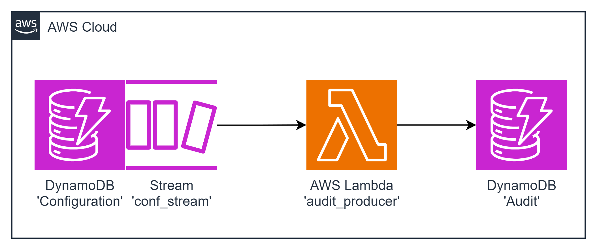

#### Architecture:

<div style="text-align: center;">
  
</div>

This task involves deploying a `Lambda function` and two `DynamoDB` tables: 'Configuration' and 'Audit'. The goal is to track changes made to configuration items in the 'Configuration' table and store audit entries in the 'Audit' table.

#### The Goal Of This Task is...
To deploy a Lambda function triggered by a DynamoDB Stream on the 'Configuration' table. The Lambda function should track changes made to configuration items and store audit entries in the 'Audit' table.

**The 'Configuration' data is the following:**

```json

{
    "key": // string, key of the configuration item
    "value": // string
}
```

Example 1: no items stored in 'Configuration' table.
The following item has been created: 
```json

{
    "key": "CACHE_TTL_SEC",
    "value": 3600
}
```

After the configuration item is saved to the table the following audit item
has been created in the 'Audit' table: 

```json

{
   "id": // string, uuidv4
   "itemKey": "CACHE_TTL_SEC",
   "modificationTime": // string, ISO8601 formatted string
   "newValue": {
       "key": "CACHE_TTL_SEC",
       "value": 3600
   },
} 
```

Example 2: the following item has been stored in the 'Configuration' table: 

```json

{
    "key": "CACHE_TTL_SEC",
    "value": 3600
} 
```

After the value of this configuration item has been changed
from 3600 to 1800, the audit item has been created 
in the 'Audit' table with the following content: 

```json

{
   "id": // string, uuidv4
   "itemKey": "CACHE_TTL_SEC",
   "modificationTime": // string, ISO8601 formatted string
   "updatedAttribute": "value",
   "oldValue": 3600,
   "newValue": 1800,
} 
```


 **AWS-syndicate:**
   - Make sure you have `aws-syndicate` installed. If not - follow the installation instructions provided in the installation tutorial.

#### For this task you should:

1. **Generate Project:**
   - Use `aws-syndicate` to generate a new project. This will set up the basic structure needed for your Lambda deployment.

2. **Generate Lambda with Runtime Java 8:**
   - Inside your project, use `aws-syndicate` to generate a Lambda function with Java 8 as the runtime. This step creates the necessary files and configurations for the Lambda.

3. **Generate 'Configuration' Table Metadata:**
   - Use `aws-syndicate` to generate metadata for a DynamoDB table named 'Configuration.'

4. **Configure DynamoDB Stream:**
   - Configure the 'Configuration' table with a DynamoDB Stream that triggers the Lambda function on changes.

5. **Generate 'Audit' Table Metadata:**
   - Use `aws-syndicate` to generate metadata for a DynamoDB table named 'Audit.'

6. **Implement the Logic of the Function:**
   - In the Lambda function code, implement the logic to handle DynamoDB Stream events, track changes made to configuration items, and store audit entries in the 'Audit' table.

7. **Build and Deploy Project with the Syndicate Tool:**
   - Use the `aws-syndicate` tool to build and deploy your project, including the Lambda function and both DynamoDB tables.

8. **Test the Application:**
   - Create and change configuration items in the 'Configuration' table.
   - Verify that audit entries are created correctly in the 'Audit' table.

#### Validation - Explanation How to Check If the Task Was Successfully Passed:

1. **Check AWS Lambda Console:**
   - Confirm that the Lambda function is listed in the AWS Lambda Console.
   - Verify that there are no deployment errors.

2. **Check DynamoDB Console:**
   - Confirm that the 'Configuration' and 'Audit' tables are listed in the AWS DynamoDB Console.
   - Verify that the 'Configuration' table has a DynamoDB Stream configured.

3. **Check CloudWatch Logs:**
   - Check the CloudWatch Logs for the Lambda function to ensure there are no errors logged during the execution.

4. **Test the Application:**
   - Create a configuration item in the 'Configuration' table.
   - Verify that an audit entry is created in the 'Audit' table.

5. **Update Configuration Item:**
   - Update a configuration item in the 'Configuration' table.
   - Verify that a corresponding audit entry is created in the 'Audit' table with the correct content.

Completing these steps successfully indicates that you have created a Lambda function triggered by a DynamoDB Stream, tracking changes to configuration items and storing audit entries in the 'Audit' table. Well done on completing this advanced AWS Lambda integration task!