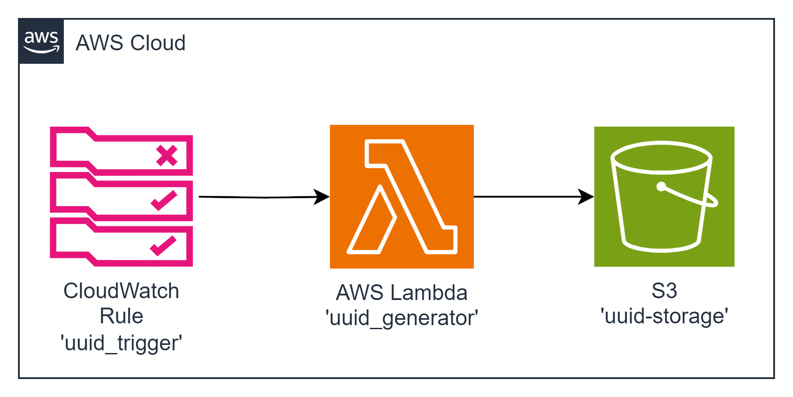

#### Architecture:

<div style="text-align: center;">
  
</div>


#### New Tools: Amazon CloudWatch Rule + Amazon Simple Storage Service

`Amazon CloudWatch Rule` is a service that enables you to schedule automated actions that self-trigger on an event. It allows you to define scheduled events (cron expressions) that trigger specified actions, making it a crucial component in time-based automation. Amazon CloudWatch Rule enables you to schedule events using cron or rate expressions, providing flexibility in defining when your Lambda function should execute. It supports precise time-based or interval-based scheduling, making it an essential tool for orchestrating various AWS services.

`Amazon Simple Storage Service (Amazon S3)` is an object storage service that offers industry-leading scalability, data availability, security, and performance. This means customers of all sizes and industries can use it to store and protect any amount of data for a range of use cases, such as websites, mobile applications, backup and restore, archive, enterprise applications, IoT devices, and big data analytics. Amazon S3 provides easy-to-use management features, so you can organize your data and configure finely-tuned access controls to meet your specific business, organizational, and compliance requirements. Amazon S3 is designed for 99.999999999% (11 9s) of durability, and stores data for millions of applications for companies all around the world.

This task involves deploying a Lambda function, a CloudWatch Rule, and an S3 bucket. The goal is to generate 10 random UUIDs every minute and store them in the S3 bucket within a new file.

#### The Goal Of This Task is...
Deploy a Lambda Function, CloudWatch Rule, and S3 bucket. The application must generate 10 random UUIDs every minute and store them in the S3 bucket within a new file.
### Example: 

Execution at 12:02

The file with lambda execution start time created in S3 bucket with 
the following content: 

File Name: ISO time of execution start 

```json

{
    "ids": [
        "9bae6daa-2f72-45d3-ad58-1221de19caaa",
        ... and 9 more
    ]
}
```

**DO NOT FORGET TO CLEAN RESOURCES TO AVOID CHARGES**

 **AWS-syndicate:**
   - Make sure you have `aws-syndicate` installed. If not - follow the installation instructions provided in the installation tutorial.

#### For this task you should:

1. **Generate Project:**
   - Use `aws-syndicate` to generate a new project. This will set up the basic structure needed for your Lambda deployment.

2. **Generate Lambda with Runtime Java 8:**
   - Inside your project, use `aws-syndicate` to generate a Lambda function with Java 8 as the runtime. This step creates the necessary files and configurations for the Lambda.

3. **Generate S3 Bucket Resource Description for the Syndicate:**
   - Use `aws-syndicate` to generate S3 Bucket resource description for the Syndicate.

4. **Generate CloudWatch Rule Description for the Syndicate:**
   - Use `aws-syndicate` to generate CloudWatch Rule resource description for the Syndicate.

5. **Implement the Logic of the Function:**
   - In the Lambda function code, implement the logic to generate 10 random UUIDs and store them in an S3 bucket within a new file. Include the execution start time in the file name.

6. **Build and Deploy Project with the Syndicate Tool:**
   - Use the `aws-syndicate` tool to build and deploy your project, including the Lambda function, CloudWatch Rule, and S3 bucket.

7. **Test the Application:**
   - Monitor the S3 bucket for the creation of new files triggered by the Lambda function executed by the CloudWatch Rule.

8. **Clean Resources:**
   - After testing, use the `aws-syndicate` tool or AWS Management Console to delete the resources (Lambda function, CloudWatch Rule, and S3 bucket) to avoid charges.

#### Validation:

1. **Check AWS Lambda Console:**
   - Confirm that the Lambda function is listed in the AWS Lambda Console.
   - Verify that there are no deployment errors.

2. **Check CloudWatch Rule Console:**
   - Confirm that the CloudWatch Rule is listed in the AWS CloudWatch Rule Console.
   - Verify that the schedule is configured correctly.

3. **Check S3 Bucket:**
   - Confirm that the S3 bucket is listed in the AWS S3 Console.
   - Monitor the bucket for the creation of new files triggered by the Lambda function executed by the CloudWatch Rule.

4. **CloudWatch Logs:**
   - Check the CloudWatch Logs for the Lambda function to ensure there are no errors logged during the execution.

5. **Clean Resources:**
   - After testing, use the `aws-syndicate` tool or AWS Management Console to delete the resources (Lambda function, CloudWatch Rule, and S3 bucket) to avoid charges.

Completing these steps successfully indicates that you have created a Lambda function triggered by an CloudWatch Rule, generating random UUIDs and storing them in an S3 bucket. Excellent job on this AWS Lambda and CloudWatch Rule integration task!