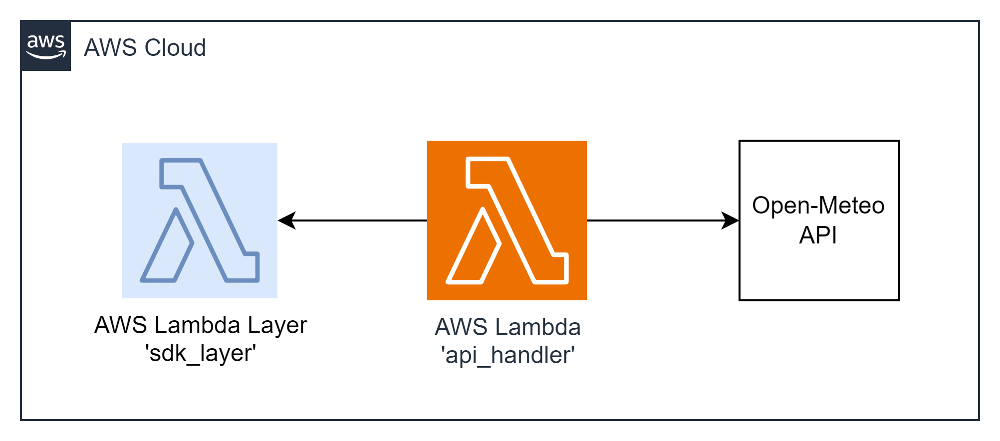

#### Architecture:

  

#### New Tools: AWS Lambda Layers + Open-Meteo API

`AWS Lambda Layers` allow you to manage your function's dependencies separately, promoting reusability and reducing deployment package sizes.

`The Open-Meteo API` provides a comprehensive set of weather data for developers. It offers access to current weather conditions, forecasts, and historical data. With a simple HTTP GET request, you can retrieve detailed weather information for a specific location, including temperature, precipitation, wind speed, and more. The Open-Meteo API supports various parameters, allowing you to customize the data you receive based on your application's requirements.

This integration task involves building a Lambda Layer containing an Open-Meteo API SDK. The SDK will facilitate the retrieval of the latest weather forecast using the Open-Meteo API. Leveraging the Open-Meteo API in your Lambda function adds real-world utility, enabling you to incorporate accurate and up-to-date weather information into your serverless applications seamlessly.

#### The Goal Of This Task is...
To build a Lambda Layer containing an Open-Meteo API SDK and use it in a Lambda function to fetch and return the latest weather forecast. 
**AWS-syndicate:**
   - Make sure you have `aws-syndicate` installed. If not - follow the installation instructions provided in the installation tutorial.

#### For this task you should:

1. **Generate Project:**
   - Use `aws-syndicate` to generate a new project. This will set up the basic structure needed for your Lambda deployment.

2. **Generate Lambda with Runtime Java 8:**
   - Inside your project, use `aws-syndicate` to generate a Lambda function with Java 8 as the runtime. This step creates the necessary files and configurations for the Lambda.

3. **Implement  Open-Meteo API SDK:**
   - Create a simple class with a method to retrieve the latest weather forecast from the Open-Meteo API.

4. **Assemble Lambda Layer:**
   - Organize your SDK code into a structure suitable for a Lambda Layer.
   - Use `aws-syndicate` to generate metadata for the Lambda Layer.

5. **Implement the Logic of the Function:**
   - In the Lambda function code, import and use the Open-Meteo API SDK from the Lambda Layer to fetch the latest weather forecast.
   
6. **Build and Deploy Project with the Syndicate Tool:**
   - Use the `aws-syndicate` tool to build and deploy your project, including the Lambda function and Lambda Layer.

7. **Test the Application:**
   - Use an API client (Postman, Insomnia) to send a GET request to the function URL (/weather) and verify that the response contains the latest weather forecast.
8. **Clean Resources:**
   - After testing, use the `aws-syndicate` tool or AWS Management Console to delete the resources (Lambda function and Lambda Layer) to avoid charges.

#### Validation:

1. **Check AWS Lambda Console:**
   - Confirm that the Lambda function is listed in the AWS Lambda Console.
   - Verify that there are no deployment errors.

2. **Check Lambda Layer Console:**
   - Confirm that the Lambda Layer is listed in the AWS Lambda Console.
   - Verify that the SDK code is correctly organized and accessible.

3. **API Client Request:**
   - Use your chosen API client (Postman, Insomnia) to send a GET request to the function URL (/weather) of the Lambda function.
   - Verify that the response contains the latest weather forecast fetched using the SDK from the Lambda Layer.
4. **CloudWatch Logs:**
   - Check the CloudWatch Logs for the Lambda function to ensure there are no errors logged during the execution.

5. **Clean Resources:**
   - After testing, use the `aws-syndicate` tool or AWS Management Console to delete the resources (Lambda function and Lambda Layer) to avoid charges.

Completing these steps successfully indicates that you have built and deployed a Lambda function using a Lambda Layer containing an Open-Meteo API SDK. Good luck with your Lambda course!