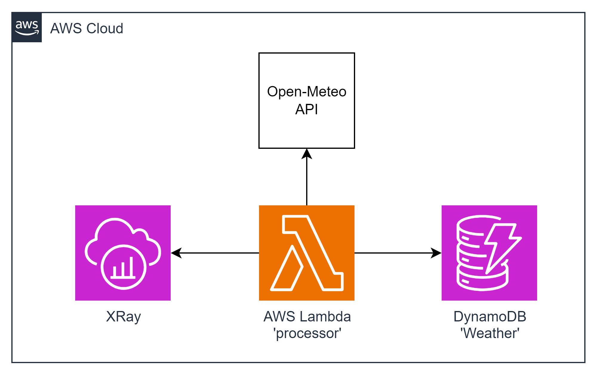

#### Architecture:
<div style="text-align: center;">
  
</div>

#### New Tool: AWS X-Ray
`AWS X-Ray` helps developers analyze and debug distributed applications in production or under development, such as those built using a microservice architecture. X-Ray, you can understand how your application and its underlying services are performing, so you can identify and troubleshoot the root cause of performance issues and errors. X-Ray provides an end-to-end view of requests as they travel through your application, and shows a map of your application’s underlying components. You can use XRay to analyze both applications in development and in production, from simple three-tier applications to complex microservices applications consisting of thousands of services.

This task involves deploying a Lambda function triggered by a Function URL, which pulls the latest weather forecast from the Open-Meteo API and pushes it to DynamoDB. The goal is to trace the execution of the code using AWS X-Ray.

#### The Goal Of This Task is...
To deploy a Lambda function that, when triggered by a Function URL, pulls the latest weather forecast from the Open-Meteo API and pushes it to DynamoDB. The execution of the code should be traced using AWS X-Ray.
Please, stick to the following schema for the 'Weather' DynamoDB table:  
```json
{
  "id": str, // uuidv4
  "forecast": {
     "elevation": number,
     "generationtime_ms": number,
     "hourly": {
         "temperature_2m": [number],
         "time": [str]
      }
      "hourly_units": {
         "temperature_2m": str,
         "time": str
      },
      "latitude": number,
      "longutude": number,
      "timezone": str,
      "timezone_abbreviation": str,
      "utc_offset_seconds": number
  }
```

 **AWS-syndicate:**
   - Make sure you have `aws-syndicate` installed. If not - follow the installation instructions provided in the installation tutorial.

#### For this task you should:

1. **Generate Project:**
   - Use `aws-syndicate` to generate a new project. This will set up the basic structure needed for your Lambda deployment.

2. **Generate Lambda with Function URL:**
   - Inside your project, use `aws-syndicate` to generate a Lambda function with a Function URL trigger.

3. **Generate DynamoDB Metadata:**
   - Use `aws-syndicate` to generate metadata for a DynamoDB table.

4. **Implement the Logic of the Function:**
   - In the Lambda function code, implement the logic to pull the latest weather forecast from the Open-Meteo API and push it to DynamoDB.
5. **Configure XRay:**
   - Use `aws-syndicate` to generate metadata for AWS XRay to record all segments from the Lambda function.

6. **Build and Deploy Project with the Syndicate Tool:**
   - Use the `aws-syndicate` tool to build and deploy your project, including the Lambda function, DynamoDB table, and X-Ray configuration.

7. **Test the Application:**
   - Use an API client (Postman, Insomnia) to send a request to the Function URL and trigger the Lambda function.
   - Monitor the AWS XRay Console for recorded segments.

8. **Clean Resources:**
   - After testing, use the `aws-syndicate` tool or AWS Management Console to delete the resources (Lambda function, DynamoDB table, and X-Ray configuration) to avoid charges.

#### Validation - Explanation How to Check If the Task Was Successfully Passed:

1. **Check AWS Lambda Console:**
   - Confirm that the Lambda function is listed in the AWS Lambda Console.
   - Verify that there are no deployment errors.

2. **Check DynamoDB Console:**
   - Confirm that the DynamoDB table is listed in the AWS DynamoDB Console.
   - Verify that data is being stored in the table.

3. **API Client Request:**
   - Use your chosen API client (Postman, Insomnia) to send a request to the Function URL of the Lambda function.
   - Verify that the function is triggered, and the latest weather forecast is pushed to DynamoDB.
   
4. **AWS XRay Console:**
   - Check the AWS XRay Console for recorded segments from the Lambda function execution.
   - Verify that the segments provide insights into the execution flow and performance.

5. **CloudWatch Logs:**
   - Check the CloudWatch Logs for the Lambda function to ensure there are no errors logged during the execution.

6. **Clean Resources:**
   - After testing, use the `aws-syndicate` tool or AWS Management Console to delete the resources (Lambda function, DynamoDB table, and XRay configuration) to avoid charges.

Completing these steps successfully indicates that you have deployed a Lambda function with X-Ray tracing, pulling weather data from the Open-Meteo API, and pushing it to DynamoDB. Excellent job on this advanced Lambda integration task!


