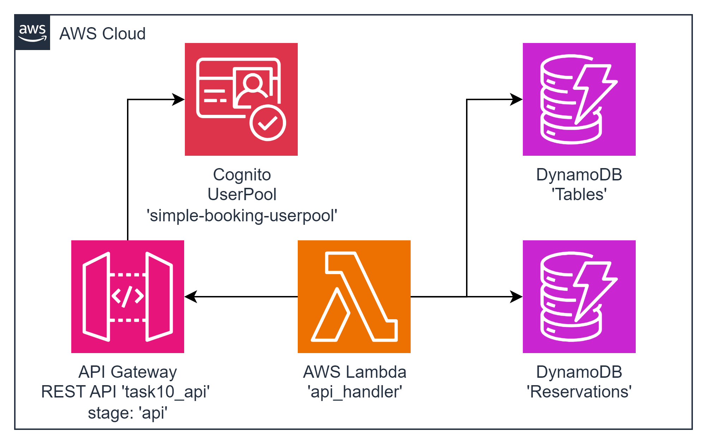

#### Architecture:
<div style="text-align: center;">
  
</div>

#### New Tool: Amazon Cognito
`Amazon Cognito` lets you add user sign-up, sign-in, and access control to your web and mobile apps quickly and easily. With Amazon Cognito, you can scale to millions of users and support sign-in with social identity providers such as Apple, Facebook, Twitter, or Amazon, with SAML 2.0 identity solutions, or by using your own identity system. In addition, Amazon Cognito enables you to save data locally on users’ devices, allowing your applications to work even when the devices are offline. You can then synchronize data across users’ devices so that their app experience remains consistent regardless of the device they use. With Amazon Cognito, you can focus on creating great app experiences instead of worrying about building, securing, and scaling a solution to handle user management, authentication, and sync across devices.

#### The Goal Of This Task is...
To deploy a serverless API with the specified resources using AWS Lambda, DynamoDB for data storage, and Amazon Cognito for user authentication. The task is to create the API service for Tables Booking at your favorite restaurant.

The following API resources must be defined:

1. **/signup POST**
   - Request:
     ```json
     {
         "firstName": // string
         "lastName": // string
         "email": // email validation
         "password": // alphanumeric + any of "$%^*", 12+ chars
     }
     ```
   - Response:
     - 200 / 400

    > NOTE: to avoid email quota errors while verification, make signup procedure without email sending while integrating with Cognito UserPool.
    > For example: if the software.amazon.awssdk.services.cognitoidentityprovider.model.AdminCreateUserRequest.builder()
    > used, then add builder method messageAction("SUPPRESS").

2. **/signin POST**
   - Request:
     ```json
     {
         "email": // email
         "password": // alphanumeric + any of "$%^*", 12+ chars
     }
     ```
   - Response:
     ```json
     {
         "accessToken": // string
     }
     ```

3. **/tables GET**
   - Headers:
     - Authorization: Bearer $accessToken
   - Request: {}
   - Response:
     ```json
     {
         "tables": [
             {
                 "id": // int
                 "number": // int, number of the table
                 "places": // int, amount of people to sit at the table
                 "isVip": // boolean, is the table in the VIP hall
                 "minOrder": // optional. int, table deposit required to book it
             },
             ...
         ]
     }
     ```

4. **/tables POST**
   - Headers:
     - Authorization: Bearer $accessToken
   - Request:
     ```json
     {
         "id": // int
         "number": // int, number of the table
         "places": // int, amount of people to sit at the table
         "isVip": // boolean, is the table in the VIP hall
         "minOrder": // optional. int, table deposit required to book it
     }
     ```
   - Response:
     ```json
     {
         "id": $table_id // int, id of the created table
     }
     ```

5. **/tables/{tableId} GET**
   - Headers:
     - Authorization: Bearer $accessToken
   - Request: {}
   - Response:
     ```json
     {
         "id": // int
         "number": // int, number of the table
         "places": // int, amount of people to sit at the table
         "isVip": // boolean, is the table in the VIP hall
         "minOrder": // optional. int, table deposit required to book it
     }
     ```

6. **/reservations POST**
   - Headers:
     - Authorization: Bearer $accessToken
   - Request:
     ```json
     {
         "tableNumber": // int, number of the table
         "clientName": //string
         "phoneNumber": //string
         "date": // string in yyyy-MM-dd format
         "slotTimeStart": // string in "HH:MM" format, like "13:00",
         "slotTimeEnd": // string in "HH:MM" format, like "15:00"
     }
     ```
   - Response:
     - 200 {reservationId: "uuidv4 string"} in case reservation is committed
     - 400 in case reservation can't be created

7. **/reservations GET**
   - Headers:
     - Authorization: Bearer $accessToken
   - Request:
     ```json
     {
         "reservations": [
             {
                 "tableNumber": // int, number of the table
                 "clientName": //string
                 "phoneNumber": //string
                 "date": // string in yyyy-MM-dd format
                 "slotTimeStart": // string in "HH:MM" format, like "13:00",
                 "slotTimeEnd": // string in "HH:MM" format, like "15:00"
             }
         ]
     }
     ```

 **AWS-syndicate:**
   - Make sure you have `aws-syndicate` installed. If not - follow the installation instructions provided in the installation tutorial.

#### For this task you should:

1. **Generate Project:**
   - Use `aws-syndicate` to generate a new project. This will set up the basic structure needed for your serverless API deployment.

2. **Generate Lambda:**
   - Inside your project, use `aws-syndicate` to generate a single Lambda function to handle all API resources.

3. **Generate DynamoDB Table Metadata:**
   - Use `aws-syndicate` to generate metadata for a DynamoDB table to store information about tables and reservations.

4. **Generate Cognito Metadata:**
   - Use `aws-syndicate` to generate metadata for Amazon Cognito to handle user authentication.

5. **Implement the Logic of the Function:**
   - In the Lambda function code, implement the logic for each API resource according to the provided specifications.
   - Include the necessary Cognito authentication checks for authenticated resources.

6. **Build and Deploy Project with the Syndicate Tool:**
   - Use the `aws-syndicate` tool to build and deploy your project, including the Lambda function, DynamoDB table, and Cognito configuration.

7. **Test the Application:**
   - Use an API client (Postman, Insomnia) to test each API resource, including signup, signin, fetching tables, fetching a specific table, making reservations, and fetching reservations.

8. **Clean Resources:**
   - After testing, use the `aws-syndicate` tool or AWS Management Console to delete the resources (Lambda function, DynamoDB table, and Cognito configuration) to avoid charges.

#### Validation - Explanation How to Check If the Task Was Successfully Passed:

1. **Check AWS Lambda Console:**
   - Confirm that the single Lambda function is listed in the AWS Lambda Console.
   - Verify that there are no deployment errors.

2. **Check DynamoDB Console:**
   - Confirm that the DynamoDB table is listed in the AWS DynamoDB Console.
   - Verify that data is being stored in the table.

3. **Check Cognito Console:**
   - Confirm that the Cognito user pool and identity pool are listed in the AWS Cognito Console.
   - Verify that users can sign up and sign in successfully.

4. **API Client Requests:**
   - Use your chosen API client (Postman, Insomnia) to test each API resource, including signup, signin, fetching tables, fetching a specific table, making reservations, and fetching reservations.
   - Verify that authentication is enforced where required.

5. **CloudWatch Logs:**
   - Check the CloudWatch Logs for the Lambda function to ensure there are no errors logged during execution.

6. **Clean Resources:**
   - After testing, use the `aws-syndicate` tool or AWS Management Console to delete the resources (Lambda function, DynamoDB table, and Cognito configuration) to avoid charges.

Completing these steps successfully indicates that you have deployed a serverless API with Cognito authentication for table bookings at a restaurant. Great job on this comprehensive serverless integration task!